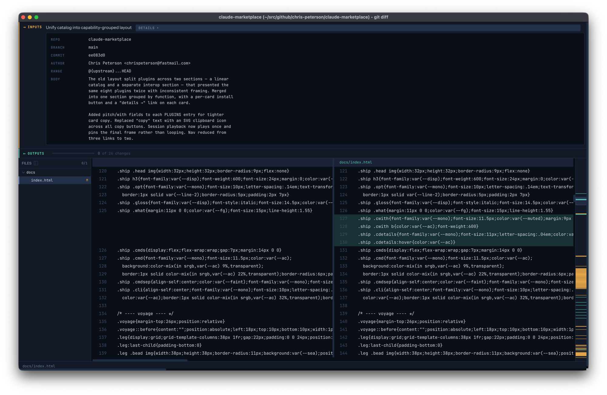
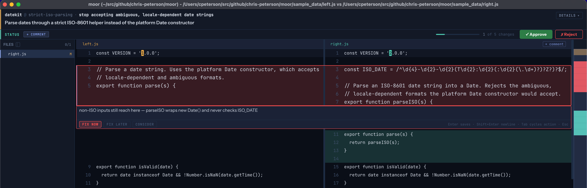
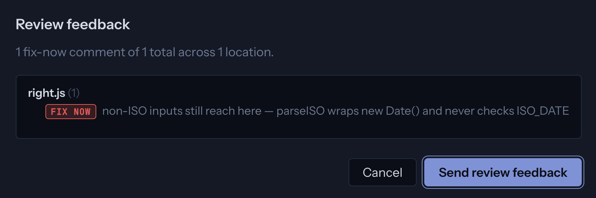

#  moor

A fast, keyboard-driven diff viewer for reviewing AI-generated code. It opens
instantly, shows a two-file or directory diff clearly, and closes when you're
done — built to be wired up as `git difftool` and to feed structured review
feedback back to the agent that produced the change.

moor does one thing: show diffs. It is not a merge tool — that's solved
elsewhere (VS Code `--merge`).

When an agent proposes a change, it hands moor the *why* along with the diff:
the commit message, the range under review, who authored it. You read the
intent up top, walk each change below, and comment where it matters — a
keystroke anchors a comment to the current change, and your feedback travels
back to the agent through the [feedback channel](#review-feedback-channel).



## The review loop in a Claude session

moor lives in the gap between an agent proposing a change and you accepting it.
A typical pass:

1. **Claude finishes a change and hands it to moor.** You don't reach for
   `git difftool` yourself — the [ambient rule](/ambient-rules) the plugin
   installs routes the launch through a sidecar so the verdict survives. An
   upstream caller wires up the `MOOR_CONTEXT` file, launches moor, and reads
   the verdict back — see the [calling contract](/calling-contract).
2. **You read the *why* before the *what*.** The briefing header up top carries
   the change's rationale — the commit message, the range under review, who
   authored it — so you start from intent, not an unlabelled wall of green and
   red (the screenshot above).
3. **You walk each change.** `j` / `k` step hunk to hunk, keeping the current
   change in view; mark hunks reviewed as you go.
4. **You comment where it matters.** `Space` anchors a comment to the current
   change. Each comment carries an action tier — **fix-now** (blocks the
   change), **fix-later**, or **consider** — so "this is wrong" and "nice
   someday" don't read the same. `Tab` in the composer cycles the tier.
5. **You give a verdict and close.** **Approve** finalizes clean; **Reject**
   opens the feedback dialog, seeding a blocking comment if you haven't left
   one. `q` closes.
6. **Your review flows back into the agent's context.** moor streams the
   verdict through the sidecar as you work and sets its exit code — `0` clean,
   `1` when any comment is fix-now, `2` unreviewed, `3` closed early. Claude
   reads your `fix-now` comments as concrete, line-anchored instructions and
   addresses them.

That last step is the point: there's no copy-pasting review notes back into
chat. The review stays inside the loop the agent is already running, so the
close of your review is the start of its fix.



On close, the send-feedback dialog lists every comment with its action tier
before it streams back to the agent — a single `fix-now` here, which sets the
exit code to `1`:



<div class="cw-session" data-cw-session="session"></div>

## Install

moor is distributed through the [chris-peterson Claude Code
marketplace](https://chris-peterson.github.io/claude-marketplace/#/). Add the
marketplace, then install the plugin:

```bash
claude plugin marketplace add chris-peterson/claude-marketplace
claude plugin install moor@chris-peterson
```

The plugin ships the Electron app and a `bin/moor` launcher. Build it once and
register it as your git difftool:

```bash
just git-install   # builds dist/ and sets diff.tool = moor
```

Put `moor` on your `PATH` with zsh tab completion, so you can launch it from
any directory:

```bash
just install-cli   # copies a wrapper to ~/.local/bin/moor + installs completion
```

The plugin checks on each session start whether the on-PATH wrapper has drifted
from the installed plugin version and reminds you to re-run it after an update.

## Updating

Third-party Claude Code marketplaces have auto-update **off by default**. Either:

- **Enable auto-update once** via `/plugin` → Marketplaces → `chris-peterson` → Enable auto-update. Future releases install on the next session start.
- **Or update manually** with `claude plugin update moor@chris-peterson`.

Confirm what's installed with `moor --version`. See the [changelog](https://github.com/chris-peterson/moor/blob/main/CHANGELOG.md) for release notes.

## Quickstart

Compare two files or two directories directly:

```bash
moor old.js new.js
moor old-dir/ new-dir/
```

Or review a working tree through git:

```bash
git difftool --dir-diff
```

moor opens a sidebar of changed files. Walk each diff, mark changes reviewed,
leave comments where they matter, and close when done. The process exit code
reflects the outcome (clean `0`, a `fix-now` comment `1`, unreviewed `2`, early
close `3`), so a calling agent or script can branch on the result.

## Keyboard reference

Navigation is vim-style and keyboard-first. The essentials:

| Key | Action |
|-----|--------|
| `j` / `k` | Next / previous change |
| `Space` / `Enter` | Comment on the current change |
| `p` | Preview current file in its registered application |
| `n` | Open the comments panel |
| `q` / `Escape` | Close |

See [Keyboard shortcuts](/keyboard) for the full reference — file navigation,
scrolling, the comment composer, the comments panel, and the quit dialog.

The two interactions you reach for most — opening a review and rejecting a
change back to the agent — in motion:

<div class="cw-session" data-cw-session="examples"></div>

## Review feedback channel

moor can hand a structured review back to the agent that asked for it. Point it
at a channel with the `--context` flag or the `MOOR_CONTEXT` environment
variable:

```bash
moor --context ./review.json old-dir/ new-dir/
```

The caller writes `input` (a `title` and `details` rendered in moor's header);
moor streams `output` back — `exitCode`, `reviewer`, and a `comments` array of
`{body, action, file?, startLine?, endLine?}` where `action` is `fix-now`,
`fix-later`, or `consider` — flushing on every state change. If the reviewer
edits the commit message directly, `output` also carries
`commitMessage: {original, edited}`. When no channel is configured, moor shows a
banner and still works as a plain viewer.

## Reference

The full behavioral contract — every requirement, keybinding, and exit code —
lives in the [Requirements](/SPEC.md).
