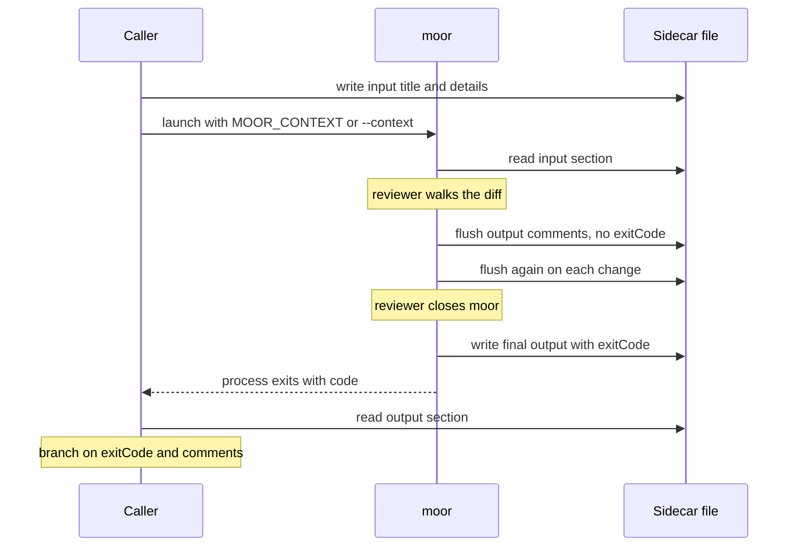

# Calling contract

moor exposes a bidirectional contract for the tool that launches it. An upstream
caller writes an `input` section to a JSON file, launches moor pointed at that
file, and reads back an `output` section — review comments and a verdict — plus
a process exit code. This page describes that contract from the caller's side:
how to launch moor, what to write, and what to read back.

The contract is caller-agnostic. Any script, CLI, or agent that can write a
file, spawn a process, and read the file back can drive moor. This page
describes the contract itself, independent of any particular caller.

The normative source is [`SPEC.md`](/SPEC.md) — the requirements referenced here
(`IM-*`, `IM.IN-*`, `IM.OUT-*`, `EC-*`) define the behavior; this page shows how
a caller uses it.

## The sidecar file

The caller and moor communicate through a single JSON file — the **sidecar**.
It has two sections:

```json
{
  "input":  { "...": "written by the caller, before launch" },
  "output": { "...": "written by moor, during and after the review" }
}
```

The caller owns the file's lifecycle: it creates the file (writing `input`),
picks the path, and reads the file after moor exits. moor writes only the
`output` section; it preserves whatever `input` it read on launch. Each write is
performed to a temp path and atomically renamed over the target, so a caller
watching the file never observes a truncated JSON document mid-write.

## Launching moor

moor is launched one of two ways.

### As git's configured difftool (git-range reviews)

To review a git range — the working tree, a commit, or a branch — register moor
as git's difftool and let git invoke it with the two sides to compare:

```bash
git config diff.tool moor
git config difftool.moor.cmd 'moor "$LOCAL" "$REMOTE"'
```

git then calls `moor <left> <right>` for you when you run `git difftool`
(`--dir-diff` opens the whole range in one session). Because git owns the
command line here, the caller wires the sidecar through the **`MOOR_CONTEXT`**
environment variable rather than a flag:

```bash
MOOR_CONTEXT=/path/to/review.json git difftool --dir-diff
```

moor itself ships no git-range launcher — the caller supplies the wrapper that
sets `MOOR_CONTEXT`, runs `git difftool`, and reads the verdict back.

### Directly on the CLI (arbitrary two-path diffs)

To diff two files or two directories unrelated to a git range, launch moor
directly and name the sidecar with `--context`:

```bash
moor --context /path/to/review.json old-dir/ new-dir/
```

### Context-channel resolution order

moor resolves the sidecar path by checking, in order (`IM-01`):

1. the `--context <path>` CLI flag (also accepted as `--context=<path>`), then
2. the `MOOR_CONTEXT` environment variable.

The first one set wins. When neither is set, moor runs as a plain viewer and
shows a warning banner in its header so the disconnect is visible during the
review rather than discovered at exit (`IM-02`); no `output` is captured.

## Input contract (caller → viewer)

Before launch, the caller writes the `input` section (`IM.IN-01`):

```json
{
  "input": {
    "title": "Cache invalidation on write-through",
    "details": [
      { "label": "repository", "value": "acme/widgets" },
      { "label": "branch",     "value": "fix/cache-writethrough" },
      { "label": "author",     "value": "Jane Roe" },
      { "label": "date",       "value": "2026-07-11" },
      { "label": "message",    "value": "Invalidate the entry before the write returns, not after." }
    ]
  }
}
```

- **`title`** — a string rendered as the change headline in moor's header.
- **`details`** — an array of `{label, value}` rows describing the change's
  provenance.

The caller decides how its context maps onto these fields — a single commit, a
range of commits, or a non-commit context all use the same shape. moor renders a
label-less header from them (`IM.IN-02`): an always-visible **location** eyebrow
(`project @ branch`, composed from the `repository` and `branch` rows) above the
**headline** (`title`). Expanding the header reveals the full commit-message body
(from a `body` / `message` / `description` row, rendered as prose) and a grid of
the remaining `details` rows. The layout degrades gracefully when a row is
absent, so a caller can supply as few or as many rows as it has.

## Output contract (viewer → caller)

moor writes the `output` section continuously during the review and one final
time on exit. A representative finalized `output`:

```json
{
  "output": {
    "reviewer": "Jane Roe",
    "comments": [
      {
        "body": "This still races with a concurrent read — invalidate under the lock.",
        "action": "fix-now",
        "file": "src/cache.js",
        "startLine": 42,
        "endLine": 45
      },
      {
        "body": "Consider a metric here.",
        "action": "consider",
        "file": "src/cache.js"
      }
    ],
    "commitMessage": {
      "original": "Invalidate the entry before the write returns, not after.",
      "edited": "Invalidate the cache entry under the write lock, before the write returns."
    },
    "exitCode": 1
  }
}
```

### Fields

- **`reviewer`** (string) — from the reviewer's `git config user.name`; `null`
  when unavailable. Always present (`IM.OUT-02a`).
- **`comments`** (array) — the review feedback. Always present, possibly empty.
- **`commitMessage`** (object, optional) — present only when the reviewer edited
  the commit message directly.
- **`exitCode`** (number, optional) — present only after moor has exited.

### Comment objects

Each comment is `{ body, action, target?, file?, startLine?, endLine? }`
(`IM.OUT-02a`). The optional fields together encode the comment's target:

| Target | Fields present |
|--------|----------------|
| Whole changeset | `body`, `action` (no `file`, no `target`) |
| Commit message | `body`, `action`, `target: "commit-message"` (no `file`) |
| A file | `body`, `action`, `file` |
| A line range in a file | `body`, `action`, `file`, `startLine`, `endLine` |

**`action`** is one of:

| `action` | Meaning | Effect on exit code |
|----------|---------|---------------------|
| `fix-now` | Must be addressed before shipping | Gates the exit code (drives `1`) |
| `fix-later` | Must be addressed, but need not block this ship | None |
| `consider` | Advisory | None |

The caller interprets the comments — for an agent caller, `fix-now` comments
read as concrete, line-anchored instructions to address before the change ships.

### Commit-message rewrite

When the reviewer edits the commit message directly, `output` carries
`commitMessage: { original, edited }` — the message as launched and the
reviewer's rewrite (`IM.OUT-07`). It is absent while the message is unedited
(including after a revert), so its presence signals an intended rewrite the
caller can apply.

### Continuous flush and finalization

moor flushes `output` after every review-state change and every comment change
(`IM.OUT-01`), so a caller watching the file sees the review take shape in real
time. During the review the flushed `output` carries `comments` (and
`commitMessage`, if edited) but **no `exitCode`**.

The presence of `exitCode` is the finalization signal (`IM.OUT-02b`): while it is
absent, the review is in progress and its comments may still change; once it
appears, moor has exited and the `output` is final. A caller that reacts before
exit should treat any pre-`exitCode` read as provisional.

## Exit codes

moor's process exit code reports the review outcome (`EC-01`..`EC-04`), and it
matches the `exitCode` written into the sidecar:

| Code | Outcome | Requirement |
|------|---------|-------------|
| `0` | All changes reviewed, no `fix-now` comments — clean approve | `EC-01` |
| `1` | One or more `fix-now` comments | `EC-02` |
| `2` | One or more unreviewed changes, no `fix-now` comments | `EC-03` |
| `3` | Closed before review began (no interaction) | `EC-04` |

A caller branches on the code:

- **`0`** — proceed; the change is approved.
- **`1`** — do not ship as-is; read the `fix-now` comments and address them, then
  re-review.
- **`2`** — the review is incomplete; the caller decides whether to treat an
  incomplete review as a block or to re-launch for another pass.
- **`3`** — no review happened; nothing to act on.

Reading the exit code from the process and reading `output.exitCode` from the
sidecar are equivalent — the latter lets a caller that only watches the file
reach the same verdict without observing the process.

## Worked example, end to end



1. **Caller writes the input file.** It picks a path (say
   `/tmp/review-abc.json`) and writes the `input` section — `title` and the
   `details` rows describing the change.
2. **Caller names the sidecar and launches moor.** For a git-range review it
   exports `MOOR_CONTEXT=/tmp/review-abc.json` and runs `git difftool
   --dir-diff`; for a direct diff it passes `--context /tmp/review-abc.json` on
   moor's command line.
3. **moor reads the input** on launch and renders the header from `title` and
   `details`.
4. **The reviewer works.** They walk each change, mark hunks reviewed, and leave
   comments with `fix-now` / `fix-later` / `consider` actions.
5. **moor flushes output continuously.** After every review-state or comment
   change it rewrites the `output` section (comments, and `commitMessage` if the
   message was edited) — without `exitCode`, since the review is still open.
6. **The reviewer closes moor.** moor writes the final `output`, now including
   `exitCode`, and the process exits with the matching code.
7. **Caller reads the output back and acts.** It reads `output` from the sidecar
   (or observes the process exit code), branches on the code, and applies the
   `fix-now` comments and any `commitMessage.edited` rewrite.

## Reference

The full behavioral contract lives in [`SPEC.md`](/SPEC.md) — the Interaction
Model (`IM`) and Exit Codes (`EC`) sections are the normative source for
everything on this page.
