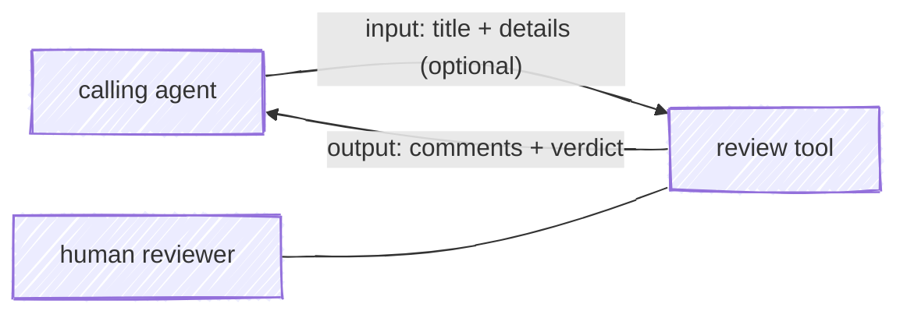

# The review-sidecar contract

A small, tool-neutral contract for **human-in-the-loop code review of agent-written changes**: an agent opens a diff for a person to review, the person leaves line-anchored comments and a verdict, and that outcome flows back to the agent as structured data it can act on.

This page defines the contract independent of any one tool. **moor is the reference implementation**; a second conformant tool is a fork of [revdiff](https://github.com/umputun/revdiff) (via its `--json` mode). A tool "speaks the contract" if it emits the **output document** and **exit code** below.

> **Why a contract, not just a tool?** The load-bearing thing the bridge.ai suite depends on is the *return channel* — the machine-readable verdict and comments the agent consumes — not the specific viewer. Pinning that to a contract lets any conformant difftool slot in. A survey of the field (Codex `/review`, hunk, diffity, revdiff) found no existing standard to defer to: peers are either AI-side reviewers, or annotate-only tools with no human-verdict channel. This contract fills that gap; the severity vocabulary is aligned with [diffity](https://github.com/nilbuild/diffity)'s `[must-fix]` / `[suggestion]` / `[nit]` / `[question]` tags.

## Shape

The two halves — what the caller provides going in, and what the tool returns coming out.



### Input (caller → tool), optional

Context the tool renders to orient the reviewer: a `title` (the change headline) and a `details` array of `{label, value}` rows (repo, branch, commit body, …). A tool MAY ignore it. moor reads it from the sidecar file's `input` section; revdiff takes `--description` / `--description-file`.

### Output (tool → caller)

A JSON document — the load-bearing half of the contract:

```json
{
  "comments": [
    { "file": "src/cache.js", "startLine": 42, "endLine": 45, "action": "must-fix", "body": "races with a concurrent read" },
    { "file": "src/cache.js", "action": "suggestion", "body": "a metric here would help" },
    { "action": "question", "body": "is this path still reachable?" }
  ]
}
```

Each comment is `{ body, action, file?, startLine?, endLine? }`. The optional fields encode the target: a **changeset** comment omits `file`; a **file** comment includes `file`; a **line/range** comment adds `startLine` and `endLine` (equal for a single line). A tool MAY carry additional fields (e.g. moor's `reviewer`, `commitMessage`, `target: "commit-message"`, and `exitCode`); a conformant consumer ignores what it doesn't recognize.

### `action` — the severity vocabulary

| `action` | Meaning | Blocking? |
|----------|---------|-----------|
| `must-fix` | Must be addressed before shipping | **Yes** — the only tier that gates the exit code |
| `suggestion` | A recommended change | No (advisory) |
| `nit` | A trivial / style point | No (advisory) |
| `question` | A query for the author | No (advisory) |

`must-fix` is the single blocking tier. There is no "fix later" tier: deferral is expressed by handing a comment to a follow-up skill (e.g. `/issue …`), keeping the in-review vocabulary about *this* ship.

### Exit code — the verdict

| Code | Meaning |
|------|---------|
| `0` | No `must-fix` comments — clean (safe to proceed) |
| `1` | One or more `must-fix` comments — blocking feedback to address |

A tool MAY define further codes for states it tracks; moor adds `2` (unreviewed changes remain) and `3` (closed before any review). A consumer that only branches on "blocking or not" reads `1` vs everything-else.

## Transport

The output document reaches the caller one of two ways; the schema above is identical either way.

- **Sidecar file** (moor's reference transport). The caller names a JSON file — via the `REVIEW_CONTEXT` environment variable or a `--context <path>` flag — writes `input` there before launch, and reads `output` back after the tool exits. The file is written atomically and flushed continuously, so a watcher never sees a half-written document.
- **Stream** (revdiff's `--json`). The tool writes the JSON to stdout (or a `-o <file>`) on exit.

## Conformance

A tool is conformant if it:

1. emits the **output document** with the comment shape and the four-value `action` vocabulary above, and
2. returns exit `1` when (and only when) at least one `must-fix` comment exists, else `0`.

Rendering agent annotations *inbound* is not enough — the return channel (comments + verdict the agent reads) is the bar. hunk, for instance, shows agent notes in a diff but has no machine-readable human verdict, so it doesn't yet qualify without an adapter.

## Reference implementations

| Tool | Transport | Exit codes | Notes |
|------|-----------|------------|-------|
| **moor** (reference) | sidecar JSON (`REVIEW_CONTEXT` / `--context`) | `0` / `1` / `2` / `3` | Full input header, `commitMessage` rewrite, commit-message comments. See the normative `IM.*` / `EC-*` / `CO-*` requirements in [SPEC](spec.md) and the [calling contract](calling-contract.md). |
| **revdiff fork** | `--json` to stdout / `-o` | `0` / `1` | Severity from a leading `[tag]` in the comment (untagged → `must-fix`). |
