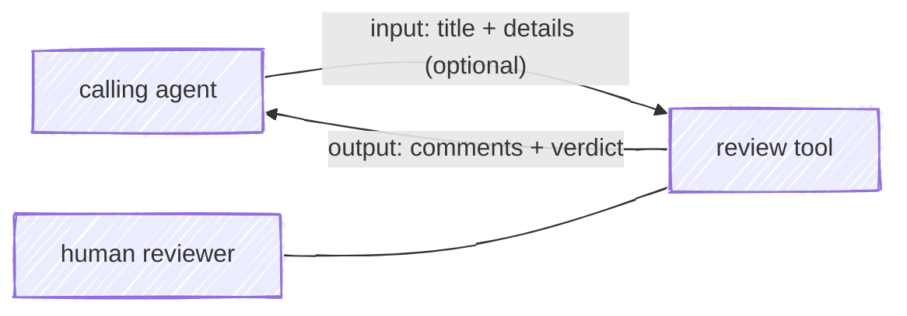

# The review-sidecar contract

A small, tool-neutral contract for **human-in-the-loop code review of agent-written changes**: an agent opens a diff for a person to review, the person leaves line-anchored comments and a verdict, and that outcome flows back to the agent as structured data it can act on.

This page defines the contract independent of any one tool. **moor is the reference implementation.** A tool "speaks the contract" if it emits the **output document** and **exit code** below.

> **Why a contract, not just a tool?** The load-bearing thing the bridge.ai suite depends on is the *return channel* — the machine-readable verdict and comments the agent consumes — not the specific viewer. Pinning that to a contract lets any conformant difftool slot in. A survey of the field (Codex `/review`, hunk, diffity, revdiff) found no existing standard to defer to: peers are either AI-side reviewers, or annotate-only tools with no human-verdict channel.

## Shape

The two halves — what the caller provides going in, and what the tool returns coming out.


```mermaid
%%{ init: { 'look': 'handDrawn' } }%%
flowchart LR
    A["calling agent"] -->|"input: title + details (optional)"| T["review tool"]
    T -->|"output: comments + verdict"| A
    H["human reviewer"] --- T
```

### Input (caller → tool), optional

Context the tool renders to orient the reviewer: a `title` (the change headline) and a `details` array of `{label, value}` rows (repo, branch, commit body, …). A tool MAY ignore it. moor reads it from the sidecar file's `input` section; revdiff takes `--description` / `--description-file`.

### Output (tool → caller)

A JSON document — the load-bearing half of the contract:

```json
{
  "comments": [
    { "file": "src/cache.js", "startLine": 42, "endLine": 45, "body": "races with a concurrent read" },
    { "file": "src/cache.js", "body": "a metric here would help" },
    { "body": "is this path still reachable?" }
  ]
}
```

Each comment is `{ body, file?, startLine?, endLine? }`. The optional fields encode the target: a **changeset** comment omits `file`; a **file** comment includes `file`; a **line/range** comment adds `startLine` and `endLine` (equal for a single line). A tool MAY carry additional fields (e.g. moor's `reviewer`, `commitMessage`, `target: "commit-message"`, and `exitCode`); a conformant consumer ignores what it doesn't recognize.

### No severity

Comments are **ungraded**. There is no `action`, severity, or priority field: a comment is something the reviewer wants addressed, and that is the whole vocabulary.

This is deliberate. Grading pushes the cost of the taxonomy onto the reviewer at the moment they are trying to describe a problem, and onto every consumer that then has to decide which tiers block. The distinction that actually matters to a calling agent — *is there feedback to act on?* — is already carried by the exit code. Where a comment genuinely shouldn't block, the reviewer says so once with the verdict (approving while sending the comments) rather than per-comment. Deferral ("address later") is expressed by handing a comment to a follow-up skill (e.g. `/issue`), which is where the follow-up has to be recorded anyway.

### Exit code — the verdict

| Code | Meaning |
|------|---------|
| `0` | No comments to act on — safe to proceed |
| `1` | Comments to address |

A tool MAY define further codes for states it tracks; moor adds `2` (unreviewed changes remain) and `3` (closed before any review). A consumer that only branches on "feedback or not" reads `1` vs everything-else.

A reviewer who wants comments delivered without blocking approves anyway: the same comments reach the caller with exit `0`. So the exit code carries the reviewer's verdict, not a count of comments.

## Transport

The output document reaches the caller one of two ways; the schema above is identical either way.

- **Sidecar file** (moor's reference transport). The caller names a JSON file — via the `REVIEW_CONTEXT` environment variable or a `--context <path>` flag — writes `input` there before launch, and reads `output` back after the tool exits. The file is written atomically and flushed continuously, so a watcher never sees a half-written document.
- **Stream.** The tool writes the document to stdout or a `-o <file>` on exit.

## Conformance

A tool is conformant if it:

1. emits the **output document** with the comment shape above, and
2. returns exit `1` when the reviewer sends comments, else `0`.

Rendering agent annotations *inbound* is not enough — the return channel (comments + verdict the agent reads) is the bar. hunk, for instance, shows agent notes in a diff but has no machine-readable human verdict, so it doesn't yet qualify without an adapter.

## Adapting a tool that doesn't speak it

Nothing requires the tool itself to emit the document. [revdiff](https://github.com/umputun/revdiff) is a terminal review TUI that writes markdown annotations to stdout (or `-o`) and exits `10` when it has any; anchor drives it through an adapter that parses those annotations into the comment shape and maps `10` onto the exit-`1` verdict. An adapter that does that faithfully is as conformant as a native emitter, and it is the cheaper path for a tool with an established output format.
